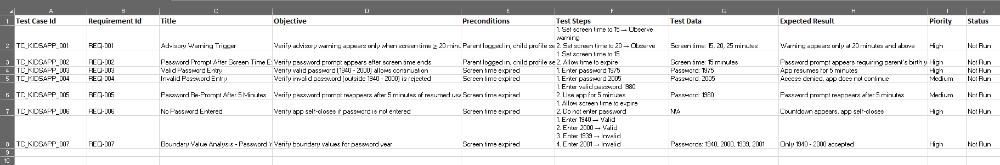

# Clothing App Checkout

## About This Test Suite
This repository contains a structured test suite for a clothing e‑commerce application (similar to Zara, H&M, or LWC).  
It demonstrates ISTQB Foundation techniques such as **boundary value analysis, positive/negative testing, and usability validation**.

The focus is on ensuring that:
- The shopping cart updates correctly when items are added or removed.
- Discounts are applied accurately to specific items.
- Checkout validation prevents empty cart transactions.
- Payment flows handle valid, expired, and invalid card scenarios.
- Boundary conditions (e.g., maximum items allowed in cart) are properly enforced.

## Test Case Categories
- **Shopping Cart** → Add, remove, and boundary value for maximum items.  
- **Discounts** → Valid and invalid discount codes, multiple discounts.  
- **Checkout Validation** → Empty cart warning, redirect to homepage, normal checkout flow.  
- **Payment** → Valid card, expired card, invalid card number.  

---

## Notes
- Status values are set to *Not Run* as this is a sample design portfolio.  
- In a real project, statuses would be updated during execution in tools like **TestRail** or **Jira Zephyr**.  
- Both `.xlsx` and `.csv` formats are provided:  
  - Excel shows professional formatting and cover page.  
  - CSV allows quick preview and import into test management tools.  

---

